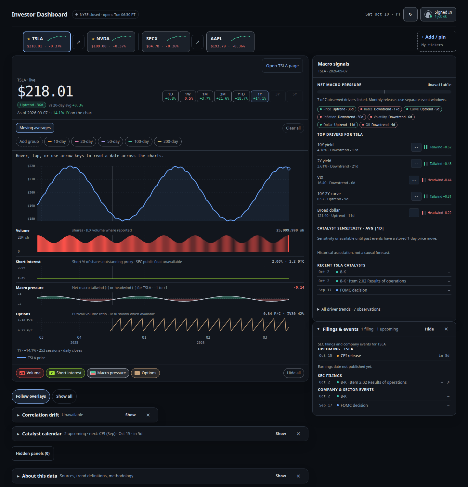
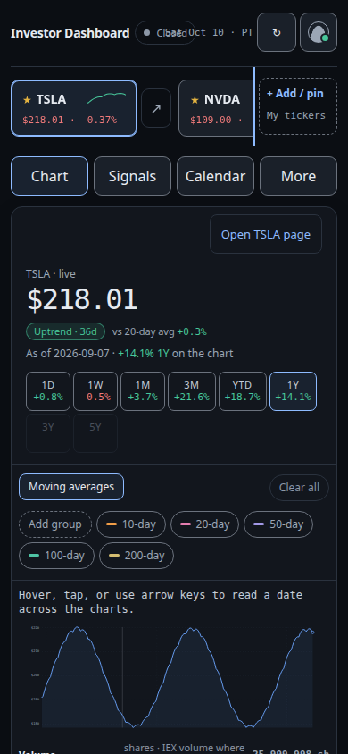

# Investor Dashboard

A low-cost dashboard that combines Tesla (TSLA) and SpaceX (SPCX) prices with bond yields, rate decisions, CPI,
tariffs, geopolitical events, robotaxi permits and SpaceX launches and contracts, to support trading decisions.

## Try the dashboard

Use the following link and demo credentials to log in to the dashboard:

| | |
| --- | --- |
| URL | https://investor.vellamsetti.com |
| Email | `ram.vellamsetti@gmail.com` |
| Password | `Serious-investor77` |



Prices in these two pictures are a local fixture, not a live market snapshot. The preview is the app after the October 10, 2026 chart, news, catalyst, and header updates.

## Using the dashboard

### Desktop and mobile
The dashboard works in desktop and mobile browsers. On a wide screen the price chart and macro panels are in the main column, with macro signals, news and filings alongside. On a phone (640px wide or less) four tabs at the top switch views:

- **Chart**: price, overlays, mini charts and catalyst toggles
- **Signals**: macro signals, plus the rates, market, moving-average and other trend drawers
- **Calendar**: inflation and the catalyst calendar drawers
- **More**: news, filings, and the company, contracts and about-this-data drawers



### Account menu and settings
The header shows the NYSE session (open, pre-market, after-hours, or closed) and the next open or close in your time zone. The top right is the date (such as Sat Oct 10 · PT), the refresh icon, and **Signed In**. On a phone the status shortens to Open, Closed, Pre, or Post, and the date is hidden. If the snapshot has no market block, the header says the status is unavailable instead of guessing.

The **Signed In** button at the top right (an icon only, on phones) opens the account menu. Under the label, a second line shows how many collection jobs are ok and how many need attention. On a phone that line is hidden; the dot on the icon stays, and the button name still includes the same words. The menu shows your sign-in email, **Private workspace**, a data-refresh status line and **Sign out**. Its items open the **Account settings** dialog on one of four tabs:

- **My tickers**: add, remove, reorder and pin tickers (up to 25 tickers, 6 pinned). Pinned tickers come first in the ticker bar.
- **Theme & display**: pick one of six color themes (Industrial Dark, Terminal Amber, Charting Navy, Clean Light, Colorblind High Contrast, Midnight Slate), the up/down color palette, and the default chart period.
- **Profile & time zone**: your signed-in email and the time zone used for timestamps.
- **Data refresh**: each data collection job with its last run, next run and status. A scheduled job shows its next run in your time zone. Trend metrics runs after market close and release day, and a ticker backfill runs when a ticker is added, so those rows name the trigger instead of saying they are unscheduled. A job that has not run yet says "Waiting for first run". On a phone each job is one card (status, name, job, last run, next run) so the status is not off-screen. The settings tabs scroll sideways, and the open tab stays in view. The sheet uses the visible viewport height so the last row stays above the browser toolbar.

### Picking a ticker
The ticker bar under the header lists your watchlist (up to 25 tickers), with pinned tickers first, each showing its last price, daily change, and a 1-month sparkline of the last 22 closes. The line uses the up/down palette. A chip with fewer than two closes shows — instead of a line. Select a ticker to load its chart and panels. **Open TSLA page** sits above the period chips and opens that ticker's company page. Enter or a long-press on a ticker opens the company page too. The page address is `#stock/TSLA` (also `/stock/<TICKER>`), so it can be bookmarked without a new CloudFront path. Back returns to the dashboard and keeps the ticker you had selected. TSLA and SPCX also have a research-page link (↗) beside the ticker; those pages bring the existing price, company, news, filing and (where available) contract panels together. Research routes (`/ticker/TSLA` and `/ticker/SPCX`) support direct links and refresh, and returning to the dashboard restores its previous ticker selection. When the list is wider than the screen, the bar scrolls sideways with a trackpad, mouse wheel, the ‹ › arrow buttons, keyboard or touch, and it keeps the selected ticker in view. The **+ Add / pin** button stays fixed at the end of the bar and opens My tickers.

### Price chart and periods
The main chart shows the selected ticker's price. Period chips **1D, 1W, 1M, 3M, YTD, 1Y, 3Y, 5Y** set the chart window, and each shows the return for that period. 1D uses hourly bars when they're available; chips for periods without enough history are disabled. A trend pill under the price (for example "Uptrend · 5d") compares the price with its 20- and 50-day averages.

### Chart overlays
Above the chart, overlay groups let you add comparison series to the chart:

- **Market**: index ETFs SPY, DIA, QQQ, IWM, XLY, ITA, SMH (hover, focus or long-press a chip for its full name)
- **Moving averages**: 10, 20, 50, 100 and 200-day
- **Rates**: 10Y and 2Y Treasury, 10Y–2Y curve, 10Y real yield, SOFR
- **Inflation**: CPI YoY, core CPI YoY, PCE YoY, 10Y breakeven
- **Risk**: VIX, broad dollar index, WTI crude
- **Policy & geo**: policy uncertainty
- **Fundamentals**: the selected ticker's quarterly revenue, gross profit, gross margin, shares outstanding, public float, and (Tesla-reported) deliveries and FSD subscribers
- **Sentiment**: 7-day news sentiment

Pick a group, then select chips to add or remove series, up to five at a time. Market overlays compare percent change; other indicators use a normalized scale. The legend under the lanes names the price line and each overlay with a line key that matches the plot: solid for price and moving averages, dashed for every other series. Averages say whether price is above or below, market series show the percent change from the start of the period, and macro series say when they are inverted or on their own scale, plus the 90-day correlation when that figure is available. Only series with data for the selected ticker and period are shown, and groups with nothing to show are hidden. **Add group** / **Clear group** affect the current group, and **Clear all** removes every overlay. Overlay choices are saved per ticker.

### Mini charts under the price chart
Mini charts appear below the main chart in a fixed order: **Volume**, **Short interest**, **Macro pressure**, **Options** (put/call ratio). Below them, a toggle bar switches each one on or off, and **Hide all** hides them all. A toggle only appears when that series has data for the selected ticker and period. These choices are saved per ticker.

### Catalyst markers
Dots on the price chart mark catalysts: published macro releases, curated events and SEC filings. The **Catalysts** bar below the mini-chart toggles filters them by category (Rates, Inflation, Policy & geopolitics, Robotaxi, Filings, Space operations, Other events), showing only categories with events in the current window. **Clear all** turns all markers off. Select a marker to open it in the catalyst calendar. Catalyst filters last for the current session and aren't saved.

### Macro trends
- **Macro signals** (right column on desktop, Signals tab on mobile):
  - **Net macro pressure**: a gauge from −1 (headwind) to +1 (tailwind) for the selected ticker. It combines each macro driver's effect, which is its 90-day correlation with the ticker multiplied by its 1-month z-score, so a driver that is far from its usual level and historically tied to the stock moves the gauge more.
  - **Top drivers**: the series with the largest effects, each labelled Tailwind, Headwind or Neutral, with 1–3 strength bars, its latest value, 1-month change and trend state (Uptrend / Downtrend / Range, based on the 1-month z-score).
  - Regime pills, catalyst sensitivity and recent catalysts, plus an "All driver trends" list you can sort. Recent catalysts are one line each: a short date, a dot in that category's chart color, the title, and the 1-day move of the aligned session. A weekend or holiday uses the next stored session. The move is "—" when that close is missing. A row outside the chart period is muted and does not focus a marker.
- **Inflation & release links**: the latest CPI and PCE releases (YoY level, trend, surprise) and how the ticker has historically moved around release dates: correlation for the week before, the days before and release day, with sample sizes. At least 12 paired releases are required.
- **Rates & yields, Correlation drift, Market comparison, Moving averages, Volatility, Dollar & oil** and the other bottom panels are collapsible drawers. The header (chevron, title, one-line summary, Show/Hide) toggles the panel. Rates, inflation, moving averages, the company panel and news start open; the rest start collapsed. Your open and closed choices are saved to your account and follow you across reloads, tickers and devices. Choosing a catalyst opens the catalyst calendar. On a phone the same drawers appear in the Signals, Calendar and More tabs.
- **Follow overlays** is the default detail-panel mode (Ram has not confirmed it over Show all). Cards for Market, Moving averages, Rates, Inflation, Risk (Volatility and Dollar & oil), Policy & geo, Fundamentals and Sentiment appear only while that group has an active overlay. Correlation drift, the catalyst calendar, contracts, about this data, macro signals and filings stay until you dismiss them. **Show all** brings the mapped cards back. Each card has a **✕** (`Hide Rates & yields`) and the active overlays' line keys. Dismissed cards are listed in **Hidden panels** and stay dismissed when you add the overlay again; Ram has not decided whether adding it should reopen the card. A phone tab with nothing left says **No panels for the active overlays · Show all**.
- **Rates & yields** opens with three shared blocks, then the existing rate rows (2Y, 10Y, 30Y, 10Y–2Y, 10Y real, SOFR, 10Y breakeven). The Treasury curve plots today's constant-maturity yields against the print from 30 calendar days earlier, with the basis-point change under each tenor from 1M through 30Y and a regime label (bull or bear steepening or flattening) when the 2Y and 10Y moves are both known. FOMC odds are a stacked cut/hold/hike bar plus a short history of the cut probability, from Kalshi when that collection is enabled. The implied policy path stays **Unavailable** until a source is chosen. A missing block names its source and the last attempt, and it does not show a zero.

All correlations describe historical association, not causation or a forecast.

Company context uses only curated events, released fundamentals and federal-award records already present in the serving data. Tesla-reported values show their source ID and release date; SpaceX launches and awards show their source and observation date. Robotaxi fleet size, state permit counts, regional FSD approvals, active-satellite counts and launch cadence remain explicitly unavailable until verified structured observations are collected. An absent or stale awards rollup is not presented as zero.

### Per-stock pages
Every watchlist ticker has a company page. The header shows the ticker, name, price, day change, last update and a freshness badge. A compact price chart sits under it. Approved company metrics are one panel each, with the series, latest value, quarter-over-quarter and year-over-year change, and provenance (source link, published date, confidence). A quarter the company did not report says **not reported**. Metrics Ram has not approved are stored and are not shown. A partial collection keeps the previous approved values and shows a partial badge. On a phone the page uses Overview, KPIs, Fundamentals and Calls. Calls stay empty until a transcript source is licensed. The page uses the same six themes and up/down palette as the rest of the dashboard.

### Coming soon
- More panels below the chart with additional trends.

## Developer guide

### Architecture

Serverless on AWS: EventBridge Scheduler and events invoke Python Lambda jobs, which write Parquet and
serving JSON to S3. A responsive static dashboard is hosted in a private S3 bucket behind CloudFront,
authenticates through Cognito PKCE, and reads authenticated API routes for user preferences and serving
data. Terraform also defines encryption, audit, monitoring and security services.

### Repository layout

| Path | What |
| --- | --- |
| `apps/web/` | Production responsive dashboard, Cognito PKCE sign-in, preferences, market charts and data states |
| `services/data-jobs/src/` | Shared collectors and Lambda handlers |
| `services/data-jobs/tests/` | Python unit tests for collectors, API, transformations, retries and historical batching |
| `services/data-jobs/scripts/` | Data-job maintenance commands |
| `infra/terraform/` | Terraform for AWS infrastructure, site hosting, API, Cognito, jobs, audit and observability |
| `infra/docker/` | Shared Lambda job image definition |
| `data/catalog/` | Data-source catalog source, documentation and workbook |
| `design/ai-generated/` | AI-generated UI canvas and reference assets; not production site content |
| `.github/workflows/` | Pull request validation and approval-gated production deployment |
| [`docs/operations.md`](docs/operations.md) | Environment setup, deploy, historical load, refresh operations and troubleshooting |
| [`infra/terraform/README.md`](infra/terraform/README.md) | Infrastructure/security baseline and Terraform setup |

### Scope and status

The wired data path includes daily prices, Yahoo five-year daily-price backfill, trends,
fundamentals, short interest, options, status and dashboard snapshot serving. The architecture's
full source catalog is not yet implemented; the Operations guide lists current schedules,
assumptions and known gaps. The dashboard currently uses zero-build JavaScript rather than the
[architecture document](docs/architecture-infrastructure.md)'s proposed TypeScript/Vite/Svelte stack.

Validate Terraform and run tests before deployment. AWS provisioning, provider access and
production browser behavior require the corresponding AWS account and credentials; successful
local validation alone does not establish production readiness.

### Next Steps: Start the AWS deployment

The deployment workflow is already defined. It is not live in AWS yet; the AWS state bucket and GitHub OIDC role/environment must be configured first. Follow the detailed `operations guide`.

1. **Prepare Terraform state.** Create a private, versioned, encrypted S3 bucket with public access blocked. Copy `infra/terraform/backend.tf.example` to `infra/terraform/backend.tf`; it is pre-filled for bucket `invdash-tfstate-308639168050` in `us-west-1`. The state bucket must exist before Terraform can initialize.

2. **Set up GitHub OIDC and production protections.** The first administrator `terraform apply` creates the GitHub OIDC provider and the `invdash-terraform-deploy` role (module `github_deploy`). The role is trusted only for this repository's `production` environment: the `sub` claim, in GitHub's immutable-ID form `repo:ram290476@48363891/investor-dashboard@1403740156:environment:production` or the name-only form, plus the repository and owner IDs, audience `sts.amazonaws.com`, ref `refs/heads/main` and the `deploy.yml` workflow ([details](docs/operations.md#who-can-assume-the-deploy-role)). Its permissions are PowerUserAccess plus IAM limited to `invdash-*` roles that carry the `invdash-workload-boundary` permissions boundary; see [the deploy role permissions](docs/operations.md#what-the-deploy-role-may-do). In GitHub, create the `production` environment, require reviewer approval and limit it to `main`; otherwise the environment is not an approval gate.

3. **Add GitHub environment values** under Settings → Environments → `production`:
   - Variable `AWS_REGION`, matching the Terraform `region` (default `us-west-1`).
   - Secret `AWS_DEPLOY_ROLE_ARN`, from `terraform output -raw github_deploy_role_arn`.
   - Secret `TF_BACKEND_CONFIG`, containing the complete S3 backend block.
   - Secret `TERRAFORM_TFVARS`, containing the non-secret Terraform settings (for example project, region, alert email and `sec_user_agent`; not `jobs_image_uri`). Do not put provider API credentials in it.

   See `terraform.tfvars.example` for the configuration shape. Provider credentials belong in SSM SecureString using `rotate-key.sh`, not in GitHub runtime config or the static site.

4. **Start deployment.** Open **Actions → Deploy production → Run workflow**, select `main`, and run it. Or merge a PR to `main`: `CI` must pass first, then `Deploy production` waits for the production environment approval. On the first run it provisions the base stack if needed, builds/pushes the arm64 job image, applies the job Lambdas, generates the ignored `Web/site/config.json`, publishes the site, invalidates CloudFront, and checks the public site/config URLs.

5. **Verify and invite yourself.** From `infra/`, run `terraform output -json site` for the CloudFront URL and `terraform output -json cognito` for the user-pool ID. Invite a user with `aws cognito-idp admin-create-user --user-pool-id <user-pool-id> --username <your-email>`, then open the CloudFront URL and complete sign-in/MFA.

6. **Start the initial price history load.** After the workflow has deployed the `backfill` Lambda, invoke it with the project prefix (default `invdash`). Include the index ETF proxies; `trend_metrics` uses them as drivers:
   ```sh
   aws lambda invoke \
     --function-name invdash-backfill \
     --cli-binary-format raw-in-base64-out \
     --payload '{"tickers":["TSLA","SPCX","SPY","DIA","QQQ","IWM","XLY","ITA","SMH"]}' \
     /tmp/backfill-result.json
   cat /tmp/backfill-result.json
   ```
   Monitor `/aws/lambda/invdash-backfill` and `curated/prices_daily/_backfill/state.json` in the lake bucket. The scheduled 15-minute run resumes incomplete batches.

**Scope note:** this deploys the implemented platform path, not every collector in the architecture catalog. Five-year history is currently for daily prices; M1 and additional macro/news/regulatory/annual collectors remain outstanding, and the freshness canary is disabled until a safe public health document is implemented. The operations guide records these limits and troubleshooting steps.
