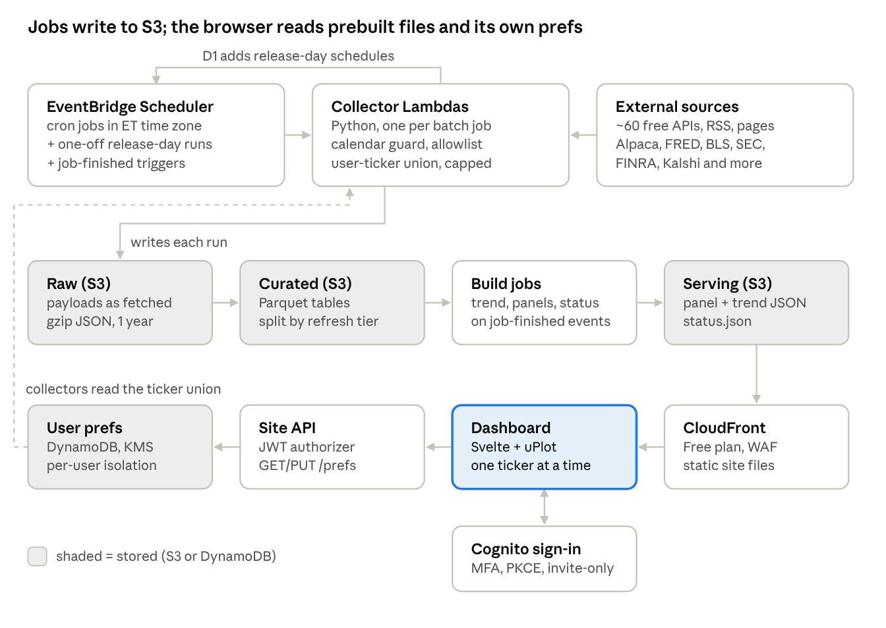
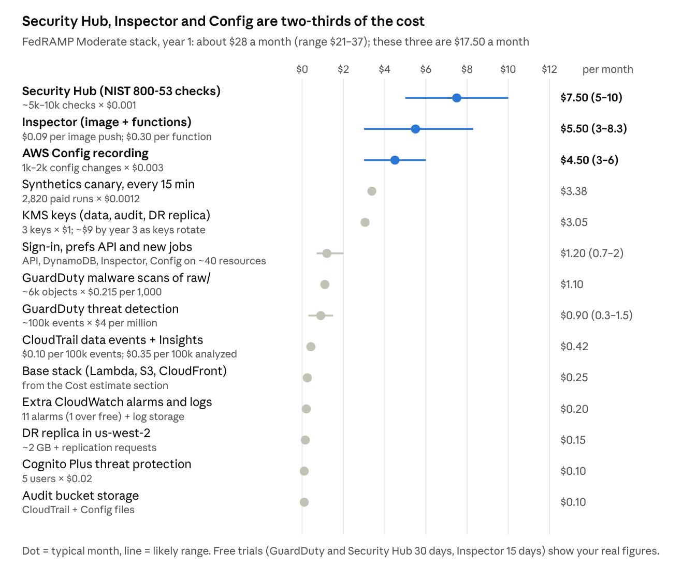
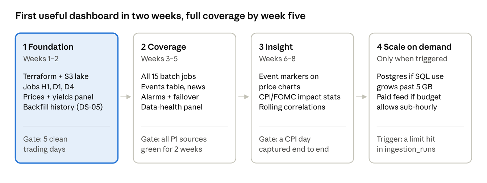

# Investor Dashboard — Architecture & Infrastructure

Oct 3, 2026 · @Ram Prasad Vellamsetti

## Summary

Run the whole system serverless on AWS: EventBridge Scheduler wakes one Python Lambda per batch job, the jobs land data as Parquet files in S3, and a static dashboard on CloudFront reads small precomputed JSON files. There is no server or database running 24/7, so the expected bill is **about \$0.25 a month including monitoring and alerts (≈\$1.60 with a custom domain)**, nearly all of it inside AWS free tiers.

- **Why it fits:** the catalog's 15 batch jobs make about 8,200 API calls and roughly 1,200 job runs a month. That is a tiny, bursty workload — the shape serverless is cheapest at.

- **Why no database server:** the data is small (well under 2 GB after a year) and append-only. Parquet on S3, queried with DuckDB, does the job of a warehouse at storage prices.

- **Why static pages:** nothing changes faster than hourly, so the browser checks one small manifest file each minute instead of holding a live connection.

- **Upgrade path:** if you later want ad-hoc SQL from many tools or sub-hourly data, add a small managed Postgres (≈\$15/mo, approximate) without changing the collectors.

**Chosen baseline: FedRAMP Moderate.** Adding the Moderate security, audit and reliability controls brings the total to about \$21–35 a month (typically ~\$27). The section "FedRAMP Moderate alignment" has the details and the Terraform starter. Multi-user sign-in, preferences and the trend jobs add about \$1.20 a month (see "Users, preferences and trend analytics").

## Requirements and constraints

The design works to the limits set in the data-source catalog: free data tiers only, nothing polled more than hourly, no runs on weekends or holidays.

| Requirement | Value | Design consequence |
|----|----|----|
| Sources | 84 catalogued, about 60 collected | One adapter per source, driven by a config file |
| Batch jobs | 15 (H1–H3, D1–D5, W1, M1, C1, Q1, A1, O1, F1) | One scheduled function per job |
| API calls | ~8,200 a month, ~270 a day | Fits every provider's free limit; a rate limiter per provider keeps it there |
| Freshest data | Hourly (prices, news, filings) | No streaming, no websockets |
| Holiday rules | NYSE, SIFMA, US federal, China, Netherlands calendars | A calendar check runs before every job |
| Release-day jobs | CPI, PCE, trade, FOMC days | One-off schedules created from the D1 calendar pull |
| Users | One (you), maybe a few family viewers | Static site with login, no app server |
| Data budget | \$0 | Hosting must also stay near zero |

## Architecture overview

architecture · collection, storage and serving

Data moves one way: the scheduler starts a collector, the collector writes raw and curated files, a build step turns them into panel files, and the browser reads only those. Because the browser never queries the lake directly, the page stays fast and nothing needs to run between jobs.

## Design patterns

Eight patterns cover the whole system; each one solves a specific problem in the catalog.

| Pattern | Where | Problem it solves |
|----|----|----|
| Config-driven registry | sources.yaml built from the catalog | Adding or moving a source is a config change, not a code change |
| Adapter (strategy) per source | fetch(since) → raw, parse(raw) → records | 60 sources with JSON, RSS, CSV, XLSX and HTML formats share one job runner |
| Calendar guard | Decorator on every job | Skips NYSE, SIFMA, federal, China and Netherlands holidays in one place |
| Watermark catch-up | Last-success timestamp per source | The first run after a weekend or outage pulls everything missed |
| Idempotent upsert | Natural keys (ticker + bar time, series + date, URL hash) | Retries and catch-ups never create duplicates |
| Failover chain + circuit breaker | Primary → F1 backups (e.g. Alpaca → Massive → Finnhub) | A failing source is skipped after 3 errors and a backup fills in |
| Token-bucket rate limiter | Per provider, counter in S3 | Stays under limits like Alpha Vantage 25/day and SAM.gov 10/day |
| Medallion layers + read model (CQRS) | raw → curated → serving | Raw payloads can be replayed; the dashboard reads small, precomputed files only |

Release days use one more pattern: **scheduled triggers from data**. Job D1 reads the BLS, BEA and Fed calendars and creates one-off EventBridge schedules for 08:35 ET on each release day.

## Data model

Tables are grouped by how often they change, and that sets their file layout: hourly tables split by month, daily by year, slower ones as one file. Every row carries source_id (DS-xx), fetched_at and run_id, so any number on the dashboard traces back to its source call.

**Raw layer** — s3://…/raw/source=DS-02/date=2026-10-03/run=…json.gz. Payloads exactly as fetched, kept 1 year, then moved to Glacier.

**Curated layer** — Parquet, written by the job that fetched it:

| Table | Tier | Key | Main columns | Partition | Filled by |
|----|----|----|----|----|----|
| prices_hourly | Hourly | ticker, bar_ts | open, high, low, close, volume, feed; covers the user-ticker union and index ETFs SPY, DIA, QQQ, IWM, XLY, ITA, SMH | year/month | H1, F1 |
| prices_daily | Daily | ticker, date | close, adj_close, volume, volume_iex, volume_source (DS-05 consolidated or DS-02 IEX), source_id | ticker | D4 close check, backfill (DS-05); price-reconcile refreshes the last 10 sessions' volume from Yahoo |
| news_articles | Hourly | url_hash | published_at, tickers\[\], title, source, sentiment, topics\[\] | year/month | H2 |
| events | Hourly / daily | event_id | event_ts, category, subcategory, title, url, entities\[\], severity | year/month | H3, D2, W1 |
| filings | Hourly | accession_no | cik, form, filed_at, url | year | H3 |
| macro_daily | Daily | series_id, obs_date | value, unit, vintage_date | year | D1, D3, D4 |
| rate_odds | Daily | source, meeting_or_horizon, as_of, outcome | probability, yes_bid, yes_ask, volume (Kalshi); Atlanta Fed and Cleveland Fed rows by column/measure | year | D1 (DS-88), D4 (DS-89, DS-90) |
| short_interest | Twice monthly | ticker, settlement_date | short_interest, previous_short_interest, avg_daily_volume, days_to_cover | settlement_date | short_interest (DS-91); SEC public-float market value is converted to estimated shares with the split-adjusted close on its measurement date, available only after filing; SEC shares outstanding is the labeled fallback |
| options_daily | Daily | ticker, date | put_call_volume_ratio, call_volume, put_volume, iv30, iv30_expiration, iv_available | date | options_daily (DS-92, Alpaca indicative feed; IV may be unavailable) |
| contracts | Daily | award_id, mod_no | agency, obligated_usd, action_date, description | year | D5 |
| launches | Daily | ll2_id | net_ts, vehicle, mission, status, outcome | year | H3, D2 |
| robotaxi_fleet | Weekly | jurisdiction, as_of | permit_type, vehicles, cities\[\] | none | D2, W1, A1 |
| risk_indices | Weekly | index, obs_date | value | none | W1, D1 |
| releases | On release | series_id, ref_period | actual, nowcast, surprise, release_ts | none | M1 |
| fundamentals_quarterly | Quarterly | ticker, metric, fiscal_quarter | release_date, measurement_date, value, unit, source_id; metrics include public_float_usd (SEC DEI, USD), shares_outstanding (SEC DEI), gross_margin_gaap, revenue_gaap, gross_profit_gaap, deliveries, fsd_subscribers | none | q1_fundamentals (DS-11 XBRL, DS-12 manual) |
| company_metrics | Quarterly | ticker, metric_id, fiscal_period | period_end, value, unit, source_url, source_doc_hash, extracted_at, confidence, approved. Proposed catalog entries are stored and not served. Raw documents stay at raw/company_ir/\<ticker\>/\<period\>/ with a manifest (source_url, fetched_at, sha256). | ticker | q2_company_ir (EDGAR EX-99.1, company IR). Catalog: curated/company_metrics/catalog/\<ticker\>.json |
| calendar_days | Monthly | calendar, date | is_open, close_time | none | C1, A1 |
| ingestion_runs | Every run | run_id | job, source_id, status, rows, error, duration_ms | year/month | all jobs |
| user_prefs (DynamoDB) | On change | user_sub | tickers\[\], pinned\[\] (max 6), display.time_zone, display.updown_palette, display.chart_period, version, updated_at | n/a | prefs API |

**Serving layer** — the compact `serving/dashboard.json` snapshot plus per-ticker `serving/chart_data/<T>.json` histories for macro overlays, macro pressure, short interest, options, and quarterly fundamentals. `serving/stock/<T>.json` is the approved-metric payload for the per-stock page (series, latest value, QoQ/YoY, provenance, run status). `GET /chart/{ticker}` and `GET /stock/{ticker}` serve only a ticker in the caller's watchlist. Proposed company metrics are omitted.

- Macro series use one long table (series_id, obs_date, value) so a new FRED or BLS series needs no schema change.

- events is the one table every timeline reads; news, filings, tariffs, launches and permits all map into it with a category.

- Each job writes its own small file per run, so jobs never write over each other. A nightly compaction merges a month's small files into one.

## Users, preferences and trend analytics

The dashboard now serves several signed-in users, each with their own ticker list. Collectors cover the union of those lists (capped to stay within free tiers), and three new build outputs feed the UI: trend metrics, quarterly fundamentals and a refresh-status feed. Together these add about **\$1.20 a month** (range \$0.70–\$2.00).

### Sign-in and preferences

- **Sign-in:** invite-only Cognito user pool (Plus tier for threat protection), MFA off (password-only for now), 15-character passwords. The site uses the authorization-code flow with PKCE through Cognito's hosted UI, with no Amplify. Tokens last 1 hour and refresh for up to 12 hours (AC-12).

- **Preferences store:** DynamoDB table invdash-user-prefs, one item per user keyed by Cognito sub (user_sub). On-demand billing, encrypted with the data key, point-in-time recovery, deletion protection.

- **Site API:** GET and PUT /prefs, GET /dashboard, GET /status, and GET /chart/{ticker} on an HTTP API with a Cognito JWT authorizer. Chart preferences are validated per ticker in the user item; chart reads are limited to the caller's watchlist. PUT needs the version it last read (a stale version returns 409). Adding a ticker nobody else follows triggers a 5-year history backfill.

Who can reach the preferences table:

| Principal | Allowed | Enforced by |
|----|----|----|
| Site API function | Nothing on the table directly; may assume the per-user role and publish TickerAdded events | Its role policy |
| Per-user role (assumed per request, tagged sub = the JWT's sub) | Get, put, update, delete only the item whose user_sub equals that tag | dynamodb:LeadingKeys = \${aws:PrincipalTag/sub} |
| Collectors (trend metrics, short interest, options, and H1/H2/D4 when built) | Scan returning only user_sub and tickers | dynamodb:Select = SPECIFIC_ATTRIBUTES and dynamodb:Attributes |
| Everyone else | Nothing | No grant |

**Why session tags rather than a Cognito variable:** IAM can't read a Cognito user-pool sub directly. The \${cognito-identity.amazonaws.com:sub} policy variable is an identity-pool ID, a different value. So the API function passes the verified JWT sub as a session tag, and IAM enforces the isolation even if the function code has a bug.

### Ticker universe and free-tier limits

Collectors cover TSLA and SPCX plus users' tickers ranked by how many users follow them, capped at 25 (max_user_tickers). The seven index ETF proxies are collected separately. Tickers over the cap are logged as dropped.

| Provider | Cost of each extra ticker | Free limit | At the 25-ticker cap |
|----|----|----|----|
| Alpaca bars (H1, D4) | None: one call covers up to 100 symbols | 200 calls/min | No change |
| Finnhub company news (H2) | 1 call per run | 60 calls/min | 27 calls per hourly run, fits |
| Massive daily close check (D4) | 1 call per day | 5 calls/min | 34 calls, about 7 minutes, fits the 15-minute timeout |
| Alpha Vantage sentiment (H2) | Not covered: see below | 25 calls/day | Stays at 16 calls/day |
| FINRA short interest | None: one query for all tickers | 1,200 calls/min | 1 call a day |
| Alpaca options (if enabled) | 1–5 chain pages | 200 calls/min | Fits |
| Yahoo backfill | 1 call, once per new ticker | Unofficial, no SLA | Fits |

**Correction to the source catalog:** DS-40 assumed one Alpha Vantage call covers TSLA and SPCX together. Alpha Vantage's multi-ticker filter matches articles that mention *all* listed tickers (per its API documentation; worth confirming on the first run). So each call now covers one ticker: 6 for TSLA, 6 for SPCX, and 4 rotating daily through other users' tickers.

### Trend metrics

The trend-metrics job runs when D4 (daily close) or M1 (release day) finishes successfully. It measures how each macro driver is moving and how strongly it has tracked each ticker. Drivers: Treasury yields and spreads, real yield, breakevens, fed funds, EFFR, SOFR, VIX, dollar index, oil, the policy-uncertainty index, CPI/core CPI/PCE YoY, and the seven ETF proxies.

| Column | Definition |
|----|----|
| chg_1w, chg_1m, chg_3m | Change over 5, 21 and 63 trading days: percent for prices and indices, level change for rates and spreads |
| z_1w, z_1m, z_3m | That change against its own trailing 252-day mean and standard deviation |
| range_pct_1y | Where today's value sits in its 1-year high–low range, 0–100 |
| trend_state, days_in_state | up if z_1m \> 0.5, down if \< −0.5, else flat; and how many days it has held |
| corr_30d, corr_90d | Rolling correlation of the driver's daily change with the ticker's daily return |
| effect | corr_90d × z_1m |
| net_pressure | tanh(sum of effect across drivers ÷ 3), the same value on every row of a ticker and date |

Monthly series hold their last released value until the next release. Output goes to serving/trend_metrics/ticker=\<T\>/trend_metrics.parquet (full history) and serving/trend_metrics/latest/\<T\>.json (last trading day, for the trend cards).

### Quarterly fundamentals

- **Gross margin:** total GAAP gross margin = GrossProfit ÷ Revenues from SEC XBRL company facts (DS-11). release_date is the SEC filing date. Q4 = full year minus Q1–Q3, because Q4 isn't filed on its own.

- **Deliveries and FSD subscribers:** not in XBRL, so they come from a reviewed manual file. scripts/add_fundamental.py validates each row and appends it to manual/fundamentals/fundamentals_manual.csv. A later row for the same quarter replaces the earlier one.

- **Schedule:** Monday 08:30 ET as a safety net, plus a one-off run the day after earnings, scheduled by D1.

- Fiscal quarters assume a calendar fiscal year (true for Tesla); SPCX's must be confirmed from its 10-K.

### New jobs and schedules

| Job | When (ET) | Source | Writes |
|----|----|----|----|
| trend-metrics | After D4 or M1 succeeds | curated prices and macro | serving/trend_metrics/ |
| q1-fundamentals | Mon 08:30 + day after earnings | SEC XBRL (DS-11), manual file (DS-12) | curated/ and serving/fundamentals_quarterly.json |
| q2-company-ir-collect | Weekdays 07:15. Fetches on Monday (weekly baseline) and on a day inside an earnings window (T-3 through T+5). An 8-K EX-99.1 for a watchlist ticker triggers extraction. | SEC EDGAR and company IR pages. robots.txt is honored. HTTP 403 and 429 are not retried. | raw/company_ir/\<ticker\>/\<period\>/ |
| q2-company-ir-extract | After collect, and on an EX-99.1 trigger | Raw IR documents. Unchanged documents skip the LLM (hash cache). | curated/company_metrics/ |
| q2-company-ir-serve | After extract | Approved catalog rows only. Partial or failed runs keep the previous serving object and emit FailedRuns. | serving/stock/\<ticker\>.json |
| short-interest | 18:30 Mon–Fri; stores only new settlement dates, so data lands twice a month on FINRA's publication days | FINRA (DS-91, OAuth keys in SSM) | curated/short_interest/ |
| options-daily | 16:50 Mon–Fri, after D4 | Alpaca indicative options (DS-92) | curated/options_daily/; enabled by default, with IV30 explicitly unavailable when the feed omits it |
| backfill | When a user adds a ticker nobody followed, and once at setup (O1) | Yahoo (DS-05) | curated/prices_daily/ |
| status-feed | After every job | Job Finished events | serving/status.json |
| H1, D4 (extended) | Existing schedules | Alpaca bars | ETF proxies and the user-ticker union added to the same calls |
| D1, D4 (extended) | Existing schedules | Atlanta Fed (DS-88), Kalshi (DS-89), Cleveland Fed (DS-90) | rate_odds |

Each job has its own role: read and write only its listed lake prefixes, read only its own API keys, publish only invdash.jobs events, and send failures to the dead-letter queue. Kalshi's documented host is now external-api.kalshi.com. The Atlanta and Cleveland Fed pages have no documented data API, so those adapters save the raw file first and find columns by header text. A layout change fails loudly and can be re-parsed from raw/.

### Refresh status and outbound allowlist

- **Status feed** (serving/status.json, behind sign-in): for each job, its name, status (ok, partial, failed, never_run), last_run, last_outcome, failed_sources and next_run. next_run skips weekends and NYSE or federal holidays. Updates use S3 conditional writes, so concurrent jobs can't overwrite each other.

- **Allowlist:** the jobs' HTTP client (app/http_client.py) refuses any host not in the source catalog. It now includes Kalshi, the Atlanta and Cleveland Feds, FINRA and the Alpaca options host. This is the software control listed under the accepted VPC risk.

### Added cost

| Item | Basis | Est. \$/month |
|----|----|----|
| Site API (HTTP API) | ~15,000 requests at \$1.00 per million ([pricing](https://aws.amazon.com/api-gateway/pricing/)) | 0.02 |
| DynamoDB prefs table | On-demand \$0.625/M writes, \$0.125/M reads; storage under the 25 GB free tier; PITR \$0.20/GB-month on \<1 MB ([pricing](https://aws.amazon.com/dynamodb/pricing/on-demand/)) | 0.01 |
| New job runs and events | ~1,500 Lambda runs (free tier); ~1,500 custom events at \$1/M | 0.01 |
| Inspector on the API function | \$0.30 per zip-packaged function | 0.30 |
| Security Hub and Config on ~40 new resources | More checks and configuration items | 0.50–1.20 |
| One more alarm, KMS requests, larger image | API 5xx alarm \$0.10; KMS and ECR | 0.15–0.40 |
| **Total** |  | **~1.20 (0.70–2.00)** |

### Names that differ from the UI brief

- The table key is user_sub; display settings live under display.time_zone, display.updown_palette (green-red, red-green, blue-orange), and display.chart_period (1D, 1W, 1M, 3M, 1Y, 3Y, 5Y; anything else is stored as 1M). Order is the order of tickers and pinned, not a separate field.

- Fundamentals use fiscal_quarter as in the brief, with metric IDs gross_margin_gaap, deliveries and fsd_subscribers, plus revenue_gaap and gross_profit_gaap as inputs.

- net_pressure is stored on every row of a ticker and date, not in a separate table.

- The data-refresh feed is serving/status.json (separate from the canary's public health.json).

## Compute and storage resources

Everything runs in one AWS region, us-west-1 (N. California), with no always-on compute. Schedules still use the America/New_York time zone, so release-time capture is unchanged. Two small pieces live in us-east-1 because AWS only offers them there: the CloudFront 5xx alarm (CloudFront metrics are published only in us-east-1) and forwarding of IAM and root sign-in events, which reach only the us-east-1 event bus.

| Resource | Service | Size and settings | Expected load |
|----|----|----|----|
| Scheduler | EventBridge Scheduler | ~15 recurring schedules (America/New_York time zone) + one-off release-day schedules | ~1,200 runs a month |
| Collector jobs | Lambda, Python 3.12, arm64, container image | 1 GB memory, 5 min timeout; 2 GB for PDF/XLSX parsing (DS-51, DS-53, DS-88) | ~24,000 GB-seconds a month (about 6% of the free tier) |
| Build jobs | Lambda (same image) | 2 GB, 10 min: serving JSON after each run, impact analytics after D4, nightly compaction | ~60 runs a month |
| Retry and dead letters | SQS dead-letter queue + Lambda retries (2) | Failed runs kept 14 days | A handful a month |
| Data lake | S3 Standard, versioning on | raw/, curated/, serving/ prefixes; raw moves to Glacier after 1 year | Under 2 GB after year 1 |
| Dashboard hosting | S3 + CloudFront (flat-rate Free plan) | Static site, gzip/brotli, 60 s cache on manifest | Far under 1M requests and 100 GB a month |
| Login | Cognito user pool | Hosted sign-in in front of CloudFront | 1–5 users |
| Secrets | SSM Parameter Store, SecureString | 12 provider credentials (Alpaca, FRED, Finnhub, BLS, BEA, Census, SAM.gov, FCC, Alpha Vantage, Massive, ACLED); see API key rotation | Read once per run |
| Container images | ECR | One image, keep last 5 tags | ~0.5 GB |
| Logs and alarms | CloudWatch Logs (400-day retention), 6 metrics, 8 alarms, 1 dashboard, SNS email | See Operations | Under 1 GB logs a month |

Why a container image: pyarrow, DuckDB, pandas and exchange_calendars together exceed Lambda's 250 MB zip limit; images allow up to 10 GB.

Why not Fargate or EC2: a t4g.small or Fargate task running 24/7 costs more than the whole serverless stack and sits idle about 98% of the time.

## Cost estimate

The full stack, **including monitoring, alerting and health dashboards**, costs about **\$0.25 a month**, or about \$1.60 with a custom domain. Prices are us-west-1 list prices (AWS Price List API, checked 6 Oct 2026); usage figures are estimates from the catalog's call counts. Compared with us-east-1 only S3 is dearer (about 13%); Lambda, KMS, Config and the free allowances are the same.

This table is the base stack. With the FedRAMP Moderate controls the total is about \$22–36 a month; see "Cost of the Moderate controls".

| Component | Price and free allowance | Our monthly use | Est. \$/month |
|----|----|----|----|
| **Collection and hosting** |  |  |  |
| Lambda (collectors + builds) | 1M requests + 400,000 GB-s free each month ([pricing](https://aws.amazon.com/lambda/pricing/)) | ~1,300 requests, ~24,000 GB-s | 0.00 |
| EventBridge Scheduler | 14M invocations free ([pricing](https://aws.amazon.com/eventbridge/pricing/)) | ~1,300 | 0.00 |
| S3 storage | \$0.026/GB-month ([pricing](https://aws.amazon.com/s3/pricing/)) | \<2 GB in year 1, ~6 GB by year 3 | 0.05 (0.16 in year 3) |
| S3 requests | \$0.0055 per 1,000 PUTs, \$0.00044 per 1,000 GETs | ~15,000 PUTs, ~50,000 GETs | 0.10 |
| CloudFront | Flat-rate Free plan, \$0: 1M requests, 100 GB, WAF, DNS ([pricing](https://aws.amazon.com/cloudfront/pricing/)) | \<20,000 requests | 0.00 |
| Sign-in check at the edge (Lambda@Edge) | \$0.60 per 1M requests, **no free tier** ([pricing](https://aws.amazon.com/lambda/pricing/)) | ~15,000 requests | 0.01 |
| Cognito sign-in | 10,000 monthly users free ([pricing](https://aws.amazon.com/cognito/pricing/)) | 1–5 users | 0.00 |
| SSM Parameter Store (API keys) | Standard parameters free ([pricing](https://aws.amazon.com/systems-manager/pricing/)) | 12 keys | 0.00 |
| SQS dead-letter queue | 1M requests free ([pricing](https://aws.amazon.com/sqs/pricing/)) | \<100 | 0.00 |
| ECR container image | \$0.10/GB-month; 500 MB free for 12 months on new accounts ([pricing](https://aws.amazon.com/ecr/pricing/)) | ~0.5 GB | 0.00–0.05 |
| **Monitoring and alerting** |  |  |  |
| CloudWatch Logs | 5 GB a month free (ingest, storage, Logs Insights scans) ([pricing](https://aws.amazon.com/cloudwatch/pricing/)) | ~0.1 GB a month, 400-day retention (stays under the free 5 GB) | 0.00 |
| CloudWatch custom metrics | 10 free, then \$0.30 each | 6 | 0.00 |
| CloudWatch alarms | 10 free, then \$0.10 each | 8 | 0.00 |
| CloudWatch ops dashboard | 3 free, then \$3.00 each ([Vantage handbook](https://handbook.vantage.sh/aws/services/cloudwatch-pricing/)) | 1 | 0.00 |
| SNS email alerts | 1,000 emails free, then \$2.00 per 100,000 ([FAQ](https://aws.amazon.com/sns/faqs)) | \<50 | 0.00 |
| AWS Budgets alert | Budget alerts free ([pricing](https://aws.amazon.com/aws-cost-management/aws-budgets/pricing/)) | 1 budget at \$5 | 0.00 |
| CloudTrail audit trail | First copy of management events free; pay S3 storage only | \<50 MB | \<0.01 |
| Data-health panel in the dashboard | Built from ingestion_runs by the build job | — | included above |
| **Optional** |  |  |  |
| Custom domain (.com on Route 53) | \$16/year since July 2026 ([Classmethod](https://dev.classmethod.jp/en/articles/route53-tld-pricing-change-2026/)); DNS included in the CloudFront plan | 1 domain | 1.33 |
| **Total** |  |  | **~0.25 (≈1.60 with domain)** |

What keeps this accurate:

- **Use a Paid-plan AWS account.** Accounts on the new Free plan close after 6 months; the always-free allowances above apply on both plans ([AWS Free Tier](https://aws.amazon.com/free/)).

- **Free allowances are per account.** If this account runs other workloads, they share the same Lambda, CloudWatch and SNS limits.

- **The \$5 budget alert** emails you if the bill drifts, so an estimate error shows up within a month.

Cost traps the design avoids:

| Avoided choice | Cost if used | What we do instead |
|----|----|----|
| Lambdas inside a VPC with a NAT gateway | ~\$33/month (\$0.045/hour, plus \$0.045/GB) ([pricing](https://aws.amazon.com/vpc/pricing/)) | Lambdas run outside a VPC; there is nothing private to reach |
| A CloudWatch metric per source (~60) | ~\$15/month (50 over the free 10 × \$0.30) | Per-source health lives in ingestion_runs; 6 summary metrics |
| Secrets Manager for 12 API keys | ~\$4/month (\$0.40 per secret) ([pricing](https://aws.amazon.com/secrets-manager/pricing/)) | SSM standard SecureString with the data KMS key, plus rotation reminders |
| Logs kept forever | Grows every month at \$0.03/GB | 400-day retention in CloudWatch; long history in S3 |
| More than 3 CloudWatch dashboards | \$3.00 each | One ops dashboard; data health lives in the app |

Options considered and not chosen:

| Option | Est. \$/month | Why not now |
|----|----|----|
| Managed Postgres (RDS db.t4g.micro) instead of S3 Parquet | ~15 (approximate) | Runs 24/7 for a workload that is busy ~2% of the time; free tier lapses after 12 months |
| Fargate or EC2 running a cron container | ~6–15 (approximate) | Same idle-time waste, plus patching |
| Grafana Cloud or Streamlit Cloud for the UI | 0 on free tiers | Less control over a dense, custom layout; Streamlit needs a running server |
| Cloudflare Workers + R2 | ~0 | Also cheap, but Python data libraries (pyarrow, DuckDB, exchange_calendars) don't run well there |

## Languages and frameworks

Python for everything that touches data, TypeScript for the browser, Terraform for the infrastructure.

| Layer | Choice | Why |
|----|----|----|
| Collectors and builds | Python 3.12 | The calendar libraries in the catalog (exchange_calendars, holidays) and most data SDKs are Python |
| HTTP and parsing | httpx (with retries), feedparser, selectolax, openpyxl, pdfplumber | Covers REST, RSS, HTML, XLSX and PDF sources |
| Data | Polars + pyarrow for transforms, DuckDB for SQL over S3 Parquet | Fast in small memory; no database server |
| Validation | Pydantic models per table | Bad payloads fail loudly instead of writing wrong numbers |
| Front end | TypeScript, Vite, Svelte | Small bundle, compiles to static files |
| Charts | uPlot for time series, Apache ECharts for heatmaps | uPlot draws dense multi-series charts and sparklines very fast; ECharts covers the rest |
| Infrastructure as code | Terraform, state in S3 | Your daily tool; every resource is reproducible |
| CI/CD | GitHub Actions with OIDC role into AWS | No long-lived AWS keys; free minutes cover a project this size |
| Tests | pytest with recorded responses per adapter | Catches a source changing its format before it reaches the dashboard |

The dashboard layout follows the project brief: dense small multiples rather than a few big charts. A top row of sparklines (TSLA, SPCX, 2Y, 10Y, 10Y–2Y, fed funds, CPI YoY, VIX), then price charts with event markers from events, then compact tables for upcoming releases, launches and permit changes.

## Operations

The system watches itself through the ingestion_runs table, and a data-health panel on the dashboard shows when each source last succeeded.

Monitoring is sized to stay inside CloudWatch's free 10 metrics, 10 alarms and 3 dashboards:

| Tool | What it covers | Count | Free limit |
|----|----|----|----|
| Custom metrics | Failed runs, stale P1 sources, stale sources (all), lowest rate-limit headroom %, manifest age (minutes), rows written | 6 | 10 |
| Alarms → SNS email | Lambda errors (all functions), Lambda throttles, dead-letter queue not empty, 2 failed runs in a row, any stale P1 source, rate-limit headroom under 20%, manifest older than 90 min in market hours, bill over \$5 | 8 | 10 |
| CloudWatch ops dashboard | Lambda runs, errors and duration; the 6 metrics; S3 size; CloudFront requests | 1 | 3 |
| Data-health panel (in the app) | Last success, age and error for every source, from ingestion_runs | 1 | not CloudWatch |
| AWS Budgets | Email at 80% and 100% of \$5 a month | 1 | free |

- **Freshness rules:** each source has a max age (hourly sources 2 h on trading days, daily 30 h, weekly 8 days). A stale source turns its panel amber.

- **Logs:** structured JSON with run_id and source_id, kept 400 days in CloudWatch (audit records 30 months in S3); ingestion_runs keeps the long history in S3.

- **Secrets:** API keys in SSM Parameter Store, encrypted with the data KMS key and rotated on a schedule (see API key rotation); the SEC User-Agent email is config, not code.

- **Backups:** S3 versioning; old versions expire after 7 days under serving/ and 90 days elsewhere. Any curated table can be rebuilt from the raw layer.

- **Schema changes:** adapters have recorded-response tests; a parse failure saves the raw file but no curated rows, so nothing wrong reaches the screen.

- **Deploys:** pushing to main runs tests, builds the image, then terraform apply; the front end deploys to S3 with a CloudFront invalidation.

- **Yearly upkeep:** upgrade exchange_calendars and holidays each December (catalog job A1) and re-check free-tier limits.

## FedRAMP Moderate alignment

Meeting the FedRAMP Moderate technical controls (NIST SP 800-53 Rev 5) raises the monthly bill from about \$0.25 to **about \$22–36 (typically ~\$28)**. Most of that is Security Hub, Inspector, AWS Config, encryption keys and an external health check. The Terraform starter below sets all of it up.

What changes from the base design:

- **Security monitoring:** GuardDuty, Security Hub with the NIST 800-53 Rev 5 standard, Inspector, AWS Config, and CloudTrail data events with Insights.

- **Encryption keys:** customer-managed KMS keys (data, audit, DR replica, and a small us-east-1 key for the CloudFront alarm topic) replace AWS-managed keys. This reverses the base design's "cost trap" choice, because SC-12 and SC-28 call for keys you control.

- **Audit records:** kept 30 months; 12 months searchable plus 18 months cold. CloudTrail logs are in an Object-Locked bucket. AWS Config history is in a separate versioned bucket with the same key, delete-deny policy and retention, because AWS Config cannot deliver to a bucket with Object Lock default retention.

- **Disaster recovery:** the data lake is replicated from us-west-1 to us-west-2.

- **Sign-in:** people sign in to AWS through IAM Identity Center with MFA; dashboard Cognito MFA is off (password-only) for now. The 12 provider API keys rotate every 90–365 days, with emailed reminders.

Scope notes:

- **Technical controls only.** A FedRAMP authorization also needs a System Security Plan, policies, a 3PAO assessment and monthly continuous-monitoring reports. Those don't apply to a personal system.

- **Region:** us-west-1 is in AWS's US East/West FedRAMP Moderate boundary (with us-east-1, us-east-2 and us-west-2), where every service used is FedRAMP Moderate authorized, except Security Hub and Budgets. AWS lists those two as "FedRAMP not required" management tools; they hold no dashboard data. CloudFront is listed with an exclusion for Embedded PoPs ([AWS services in scope](https://aws.amazon.com/compliance/services-in-scope/FedRAMP/)).

- **Log retention:** FedRAMP's AU-11 parameter points to OMB M-21-31 (12 months active, 18 months cold) ([AU-11](https://ce.prod.cloudaware.com/frameworks/fedramp-moderate-security-controls/au/11)). [OMB M-26-14](https://axoflow.com/blog/omb-m-26-14-what-federal-agencies-need-to-know-about-the-new-logging-mandate), signed 22 May 2026, replaced M-21-31 with 6 months searchable plus 12 months cold. Keeping 30 months meets both.

### Observability

Every signal carries the same run_id and source_id, so one job run can be followed from schedule to log line to trace to the dashboard's data-health panel.

| Signal | What is collected | Where it goes | Kept |
|----|----|----|----|
| App logs | JSON lines with UTC time, job, run_id, source_id, outcome, rows, duration, X-Ray trace id, error type (AU-3, AU-8) | CloudWatch Logs, encrypted with the audit key; 3 saved Logs Insights queries | 400 days |
| Metrics | 6 custom: FailedRuns, RowsWritten, StaleP1Sources, StaleSources, FreshP1Ratio, RateLimitHeadroomPct (one service dimension only) | CloudWatch | 15 months |
| Traces | One X-Ray segment per job, one subsegment per source call | X-Ray (within free 100,000 traces) | 30 days |
| External check | Synthetics canary every 15 min fetches health.json through CloudFront: HTTP 200, data under 90 min old in market hours, no stale P1 source | CloudWatch Synthetics | Artifacts 31 days |
| API audit trail | All management events, lake object reads and writes, Lambda invocations; integrity-validated log files; Insights on unusual call or error rates | CloudTrail → Object-Locked S3 | 30 months |
| Configuration history | Every resource change, continuously | AWS Config → config bucket (versioned, KMS, delete-deny; no Object Lock, which Config does not support) | 30 months |
| Threats and vulnerabilities | GuardDuty findings (incl. malware scans of raw/), Inspector CVEs, Security Hub NIST 800-53 control results | Security Hub | 90 days of findings |

Alerts go to two email topics: **ops** for reliability and **security** for incident response.

- **Ops (8–11 CloudWatch alarms):** Lambda errors, throttles, dead-letter queue not empty, failed runs, stale P1 source, quota headroom under 20%, freshness SLO burn, canary failing, availability SLO fast and slow burn, CloudFront 5xx (in us-east-1, with its own topic).

- **Security (8 EventBridge rules, free):** GuardDuty findings rated medium or higher, high or critical Security Hub and Inspector findings, attempts to stop or weaken logging, monitoring or keys, S3 exposure changes, IAM changes, root or no-MFA sign-ins, and any API key change. IAM and global sign-in events arrive only in us-east-1, so two rules there forward them to the primary region's bus (no extra alerts: each event reaches one region).

- **AWS Health events** go to the ops topic.

- **Dashboards:** two CloudWatch dashboards, ops and SLO. Data health per source stays in the app's own panel.

### Reliability

Three service-level objectives (SLOs) set the alert thresholds, and burn-rate alarms fire before a month's error budget runs out.

| SLO | Target (30 days) | Measured by | Error budget | Alarms |
|----|----|----|----|----|
| Availability | 99.5% of health checks pass | Synthetics canary success % | ~3.6 hours | Fast burn: under 92.8% over 1 h. Slow burn: under 97% over 6 h |
| Freshness | 99% of P1 sources within max age, business hours | FreshP1Ratio from the build job | ~1% of P1 checks | Slow burn: under 94% over 6 h |
| Release capture | Every CPI, PCE and FOMC release stored within 15 min | releases table vs D1 calendar | Zero | Each miss gets a written review |

Recovery targets (CP-2, CP-9, CP-10):

| Failure | Recovery point (RPO) | Recovery time (RTO) | How |
|----|----|----|----|
| Bad data or deleted file | 0 (every version kept 90 days) | 30 min | Restore the prior S3 object version, rebuild serving files |
| Source outage | 0 (watermark catch-up) | Next run | Failover chain to backup source; catch-up when the primary returns |
| Bad deploy | 0 | 10 min | Re-point Lambda aliases to the previous immutable image tag |
| us-west-1 regional outage | Minutes (replication lag) | 4 h | terraform apply with region set to us-west-2 (and dr_region set to another region, e.g. us-east-2), using the replica bucket and replica key |

Practices built into the jobs:

- **Retries with backoff and jitter**, then 2 Lambda retries, then the dead-letter queue.

- **Bulkheads:** a failing source is logged and counted, and the job carries on with its other sources.

- **Idempotent writes and watermarks**, so replays and catch-ups are safe.

- **Reserved concurrency** on every function caps runaway loops and cost.

- **Timeouts** on every HTTP call (10 s connect, 30 s read).

Testing (CP-4):

- **Quarterly game day:** disable a primary source, delete a curated file and restore it, redrive the dead-letter queue.

- **Yearly regional drill:** rebuild from the replica in us-west-2.

- Each drill and each incident ends with a short written review, kept in the project.

### API key rotation

Twelve provider credentials are rotated on a fixed schedule, and a daily check emails a reminder before each one is due (IA-5). The source of truth is each key's last-changed date in SSM; the Status column below is for your own tracking.

| Key (SSM name) | Provider | Used by | Rotate every | Why | Status |
|----|----|----|----|----|----|
| sam-gov | [SAM.gov](https://sam.gov/profile/details) | DS-68, DS-69 | 90 days | Provider expires personal keys every 90 days | Not stored yet |
| alpaca-key-id | [Alpaca](https://app.alpaca.markets/) | DS-02, DS-82 | 180 days | Account-level key; use paper-trading keys only | Not stored yet |
| alpaca-secret-key | [Alpaca](https://app.alpaca.markets/) | DS-02, DS-82 | 180 days | Rotated together with the key ID | Not stored yet |
| bls | [BLS](https://data.bls.gov/registrationEngine/) | DS-21 | 365 days | Provider requires yearly renewal | Not stored yet |
| fred | [FRED](https://fredaccount.stlouisfed.org/apikeys) | DS-15, DS-16, DS-26, DS-39, DS-45, DS-23 | 365 days | Policy; key never expires | Not stored yet |
| finnhub | [Finnhub](https://finnhub.io/dashboard) | DS-41, DS-13, DS-04 | 365 days | Policy | Not stored yet |
| alpha-vantage | [Alpha Vantage](https://www.alphavantage.co/support/) | DS-40, DS-03 | 365 days | Policy | Not stored yet |
| massive | [Massive (Polygon)](https://massive.com/dashboard) | DS-01, DS-42 | 365 days | Policy | Not stored yet |
| bea | [BEA](https://apps.bea.gov/API/signup/) | DS-24 | 365 days | Policy | Not stored yet |
| census | [Census](https://api.census.gov/data/key_signup.html) | DS-34 | 365 days | Policy | Not stored yet |
| api-data-gov | [api.data.gov](https://api.data.gov/signup/) (FCC) | DS-74 | 365 days | Policy | Not stored yet |
| acled-password | [ACLED](https://acleddata.com/) (myACLED login) | DS-36 | 365 days | Policy; the app trades it for 24-hour tokens | Not stored yet |

Sources for provider rules: SAM.gov 90-day expiry ([Edgrapi](https://edgrapi.com/blog/sam-gov-api-rate-limits), [HHS simpler-grants issue](https://github.com/HHS/simpler-grants-gov/issues/7640)); [BLS API FAQ](https://www.bls.gov/developers/api_faqs.htm); ACLED token lifetimes ([ACLED docs](https://acleddata.com/api-documentation/getting-started)).

How reminders work (Terraform module api_keys, about \$0 a month):

- Each key is an SSM SecureString under /invdash/api-keys/, encrypted with the data KMS key and tagged with its rotation period. Terraform creates a placeholder and never holds the real value.

- Every day at 8:00 PT a small Lambda reads only metadata and tags, never the key values. It emails the security topic 14, 7, 3, 1 and 0 days before a key is due, daily once a key is overdue, and on Mondays while a key has never been stored.

- Every change to a key triggers an api-key-changed security alert, and CloudTrail keeps the change for 30 months.

- Jobs read keys with a 5-minute cache, so a new key takes effect without a redeploy.

To rotate a key:

1.  Regenerate it at the provider (the email links there). If the provider allows two keys at once, create the new one first.

2.  Run scripts/rotate-key.sh \<key\> and paste the value. It never touches shell history or the process list.

3.  After the next job run succeeds, revoke the old key at the provider.

4.  Rotate right away, off schedule, if a key may have leaked.

**Why SSM instead of Secrets Manager:** both are FedRAMP Moderate authorized and both meet IA-5, SC-28, AC-6 and AU-2 here. Secrets Manager's automatic rotation can't help, because none of these providers has a rotation API. The daily check supplies the last-rotated evidence that Secrets Manager would show, without its ~\$5 a month for 12 secrets.

### Accepted risk: job Lambdas outside a VPC

The job Lambdas stay outside a VPC as a documented accepted risk. They can reach any internet host, which falls short of SC-7(5) (deny outbound traffic unless allowed) and AC-4 (information flow enforcement). What's at stake is public market data and free API keys, and closing the gap would at least double the monthly bill.

Compensating controls:

- **Least privilege:** each job role can write only its own lake prefix and read only the keys it uses.

- **Network monitoring:** GuardDuty Lambda Protection watches network activity of functions outside a VPC too, which keeps SI-4 covered ([AWS docs](https://docs.aws.amazon.com/guardduty/latest/ug/lambda-protection.html)).

- **Code checks:** Inspector scans the image and functions; pip-audit and Checkov run in CI.

- **Software allowlist:** the jobs' HTTP client refuses hosts that aren't in the source catalog (built: app/http_client.py).

Options if the risk is no longer acceptable:

| Option | Extra \$/month | What it covers |
|----|----|----|
| Keep as is (this decision) | 0 | Gap covered by the controls above |
| VPC + NAT gateway + Route 53 DNS Firewall allowlist of ~60 provider domains + free S3 gateway endpoint | ~33 | Blocks by domain name; doesn't stop connections made straight to an IP address |
| VPC + AWS Network Firewall (NAT charges waived when paired) | ~290 | Enforces SC-7(5) as written ([pricing](https://aws.amazon.com/network-firewall/pricing/)) |

Revisit this decision if the system ever holds non-public data or a trading credential with real-money access. Running the jobs off AWS (on a home machine or another cloud) is not an option: it would pull that machine into what has to be secured and lose the controls AWS covers.

### Base-design choices revisited

Two cost-saving choices from the base design fall short of Moderate and are changed; one is kept as an accepted risk; the rest don't affect any control.

| Base-design choice | Effect under FedRAMP Moderate | Resolution |
|----|----|----|
| Logs kept 14 days in CloudWatch | Yes: falls short of AU-11 retention | **Changed:** 400 days in CloudWatch, 30 months in S3 |
| AWS-managed KMS keys | Partly: SC-28 is met, but SC-12 key control and AU-9(4) audit-log separation need your own keys | **Changed:** data, audit and DR replica keys |
| Lambdas outside a VPC, no NAT gateway | Yes: SC-7(5), AC-4 | **Kept** as an accepted risk (above) |
| SSM Parameter Store instead of Secrets Manager | No, provided keys use your KMS key and follow a rotation schedule | **Kept**, with the data key and the rotation reminders |
| Six summary metrics instead of one per source | No: SI-4 and AU-6 need the monitoring, not that kind of metric; ingestion_runs and logs cover each source | Kept |
| Few CloudWatch dashboards | No | Kept; Moderate adds an SLO dashboard (2 of the 3 free) |
| Parquet on S3 instead of a database server | No: versioned, encrypted S3 meets SC-28 and CP-9 | Kept |

### Control mapping

The table maps each relevant Moderate control to how it is met and where it is built. "App" means the job, CloudFront or Cognito code, which comes outside this starter.

| Control | Requirement | How it is met | Built in |
|----|----|----|----|
| AC-2(4) | Automated audit of account changes | EventBridge alert on IAM user, key, policy and MFA changes | alerting |
| AC-3, SC-7 | Access enforcement, boundary protection | Account-wide S3 public-access block; TLS-only bucket policies; WAF on CloudFront; job Lambda outbound traffic unrestricted (accepted risk) | security_services, data_lake, app |
| AC-6 | Least privilege | One IAM role per job; Access Analyzer flags external access; per-user DynamoDB isolation through a session-tagged role and dynamodb:LeadingKeys | security_services, app |
| AC-7, AC-8, AC-12 | Lockout, sign-in banner, session end | Cognito lockout and Plus-tier threat protection; banner; 1-hour tokens, 12-hour refresh | app |
| AU-2, AU-12 | Event logging | CloudTrail management, lake data and Lambda events; app logs | audit_logging, observability |
| AU-3, AU-8 | Record content, time stamps | JSON schema: who, what, when (UTC), source, outcome, run_id | app/observability.py |
| AU-5 | Response to logging failure | Alert on StopLogging, DeleteTrail, recorder stop, key disable | alerting |
| AU-6 | Review and analysis | Security Hub, CloudTrail Insights, saved Logs Insights queries, weekly review | security_services, audit_logging, observability |
| AU-9, AU-9(4) | Protect audit records | Object Lock (CloudTrail); versioning and deny-delete/deny-unversion policy (Config); separate audit key; log-file validation | audit_logging, kms |
| AU-11 | Retention | 400 days in CloudWatch; 30 months in S3 | audit_logging, observability |
| CA-7 | Continuous monitoring | Security Hub NIST 800-53 Rev 5 standard over AWS Config data | security_services |
| CM-2, CM-3, CM-6 | Baseline, change control, settings | Terraform; pull request + CI + approval gate; Checkov policy scan | all modules, ci.yml |
| CM-8 | Component inventory | AWS Config continuous recording | audit_logging |
| CP-2, CP-4 | Contingency plan and testing | SLOs, recovery table, quarterly game days, yearly regional drill | observability, this doc |
| CP-6, CP-9, CP-10 | Alternate storage, backup, recovery | Versioning; cross-region replica with replica key; immutable images | data_lake, kms |
| IA-2(1), IA-2(2) | MFA | IAM Identity Center MFA for AWS; Cognito dashboard MFA currently off (password-only; Plus threat protection on) | account setup, app |
| IA-5 | Authenticator management | No long-lived CI keys (OIDC); API keys in SSM with the data key, rotated every 90–365 days with daily reminders; IAM password policy | ci.yml, security_services, api_keys |
| IR-4, IR-5, IR-6 | Incident handling and reporting | GuardDuty + EventBridge → security email; review template | alerting, security_services |
| RA-5, SI-2 | Vulnerability scanning, flaw fixes | Inspector on image and functions; pip-audit and Checkov in CI | security_services, ci.yml |
| SC-8 | Encryption in transit | TLS 1.2+ enforced on S3, SQS, SNS; CloudFront TLS 1.2 policy | data_lake, alerting, app |
| SC-12, SC-13, SC-28 | Keys, FIPS crypto, encryption at rest | Customer-managed KMS keys rotated yearly; FIPS endpoints for app calls | kms, outputs |
| SI-3 | Malicious code protection | GuardDuty Malware Protection scans downloads in raw/ | security_services |
| SI-4 | System monitoring | GuardDuty, alarms, external canary, AWS Health events | security_services, observability, alerting |
| SI-7 | Integrity | CloudTrail digest validation; immutable image tags | audit_logging, data_lake |
| SI-11 | Error handling | Dead-letter queue; errors logged by type without secrets | data_lake, app |

### Cost of the Moderate controls

AWS list prices, us-east-1, checked 3 Oct 2026 · usage estimated from the data catalog

The chart uses us-east-1 prices. In us-west-1 only S3 costs more (cents at this size); the us-east-1 alerts key adds \$1, giving \$22–36. The separate AWS Config bucket adds well under \$0.10 a month (a few MB of history a month at \$0.026/GB, with a bucket key keeping KMS requests negligible).

Security Hub and Config costs scale with how often resources change, so batching deploys keeps them near the low end. Updated levers: hourly canary checks save ~\$2.50; turning off malware scanning saves ~\$1.10 but leaves an SI-3 gap. The \$40 budget alert gives headroom above the high estimate.

Price sources: [GuardDuty](https://aws.amazon.com/guardduty/pricing/), [Security Hub CSPM](https://aws.amazon.com/security-hub/cspm/pricing/), [Config](https://aws.amazon.com/config/pricing/), [Inspector](https://aws.amazon.com/inspector/pricing/), [KMS](https://aws.amazon.com/kms/pricing/), [CloudTrail](https://aws.amazon.com/cloudtrail/pricing/), [Synthetics](https://aws.amazon.com/blogs/aws/new-use-cloudwatch-synthetics-to-monitor-sites-api-endpoints-web-workflows-and-more/), [X-Ray](https://lumigo.io/learn/what-is-aws-x-ray/), [EventBridge](https://aws.amazon.com/eventbridge/pricing/), [Cognito](https://aws.amazon.com/cognito/pricing/).

### Terraform starter

The starter (investor-dashboard-infra.zip, AWS provider 6.x) deploys everything in this section except the CloudFront site and the H1–A1 collector Lambdas (their adapters are in \`app/collectors/\`). Those plug into its outputs.

| Module or file | Creates |
|----|----|
| kms | Data key (multi-Region, with a us-west-2 replica) and a separate audit key, rotated yearly |
| data_lake | Lake bucket with versioning, KMS and TLS-only access, replicated to us-west-2; job dead-letter queue; ECR repo with immutable tags |
| audit_logging | CloudTrail with data events, validation and Insights into an Object-Locked audit bucket; AWS Config into its own versioned config bucket |
| security_services | GuardDuty with S3, Lambda and malware protection; Security Hub NIST 800-53 Rev 5; Inspector; Access Analyzer; account guardrails |
| alerting | Encrypted ops and security topics; 9 EventBridge rules, including API key changes |
| us_east_1 | CloudFront 5xx alarm with its own encrypted topic and key; forwarding of IAM and root sign-in events to the primary region |
| observability | Log groups, saved queries, alarms with SLO burn rates, 2 dashboards, canary, \$40 budget |
| api_keys | 14 SSM SecureStrings with rotation periods (now including FINRA); daily 8:00 PT check that emails reminders |
| site_auth | Invite-only Cognito user pool (Plus, MFA off / password-only for now) and PKCE web client |
| user_prefs | DynamoDB prefs table, site API (GET/PUT /prefs, JWT authorizer), per-user isolation role, collector read policy, 5xx alarm |
| jobs | Six container-image job Lambdas with their own roles, schedules (ET), event triggers and DLQ; created once jobs_image_uri is set |
| workload_boundary | invdash-workload-boundary permissions boundary on every IAM role (no IAM writes; no role assumption except the prefs API hop) |
| github_deploy | GitHub OIDC provider and the invdash-terraform-deploy role (production environment, main, deploy.yml only; PowerUserAccess plus IAM limited to bounded invdash-* roles) |
| app/ | Observability, API key reader, HTTP allowlist, ticker universe, lake helpers, status feed, collectors (Alpaca, FINRA, Kalshi, Fed sources, Yahoo) |
| functions/ | trend_metrics, q1_fundamentals, short_interest, options_daily, backfill, status_feed, prefs_api, key_rotation_check |
| Dockerfile, requirements-jobs.txt | One arm64 job image |
| tests/ | 39 pytest tests: trend formulas, XBRL quarters, prefs isolation and validation, collector parsers, status feed, allowlist |
| scripts/ | rotate-key.sh, add_fundamental.py |
| .github/workflows/ci.yml | fmt, validate, Checkov, ruff, pytest, shellcheck, pip-audit; arm64 image build; approval-gated apply through OIDC |

Before the first apply:

1.  Use a Paid-plan AWS account and sign in through IAM Identity Center with MFA.

2.  Import any existing Config recorder, GuardDuty detector or Security Hub account; only one of each is allowed per region.

3.  Run terraform fmt -recursive and terraform validate. I couldn't download the Terraform binary in my workspace, so the code was checked with an HCL parser, a cross-reference script and a smoke test of the Python helper.

4.  Set alert_emails, apply, and confirm the subscription emails. Add health_url once the site is live to turn on the canary.

Expect security alerts during your own deploys (key policy and trail updates count as changes); that is the change-control audit trail working.

## Roadmap and scaling path

phased roadmap · weeks from start, not to scale

Each phase ships something you can use, and phase 4 happens only if a measured limit is hit. Collectors and the data model stay the same through every phase; scaling swaps the storage or a feed, not the design.

Open questions:

- Will anyone besides you view the dashboard? That decides whether Cognito sign-in is needed or a simpler private link is enough.

- Do you want a custom domain (about \$1 a month), or is the CloudFront address fine?
